# Mockups: the target interface

Static pictures of what GDD [17](../gdd/17-ui-declutter.md), [18](../gdd/18-headlines.md) and
[19](../gdd/19-realm-ledger.md) ask for, so the person building it can *see* the goal. They are **design targets, not
screenshots of running code**: the map behind them is a real screenshot from `docs/screens/`, the faces and banners are
the game's own painted art (`assets/`), the text is written to the GDD's rules (headlines ≤ 12 words, no knowledge past
298 AC, `~` estimates dated). Every page carries a small "MOCKUP — target design" tag on the left edge.

Each `NN-*.html` is a self-contained page (inline CSS; it loads the bundled fonts from `public/fonts/` and the images from
`assets/` and `../screens/`). Open it in a browser and resize the window: the layout is responsive, and was checked at
1920×1080 and 1366×768.

- Regenerate the pictures: `node scripts/mockups.js [01 03 …]` (Playwright, SwiftShader args as `scripts/screens.js`;
  a picture over 1.5 MB is saved as JPEG instead, which is why `07` at 1920 is a `.jpg`).
- Repaint the portraits and banners from the game's own code: `node scripts/mockup-assets.js`.
- The HTML is generated by `build.mjs` (shared pieces in `lib.mjs`); edit either the generated pages or the generator.
- Dev tools only: Playwright is never a runtime dependency (CLAUDE.md).

**What they are for.** When a work package says "see the mockup", match its structure, hierarchy, density and empty
space; the exact pixels and copy are not binding. If real content does not fit (a long house name, five vitals), keep the
*rule* (few things, big map, one place for each thing) and record the departure in `docs/gdd/DECISIONS.md`.

---

## 01 · Before, annotated (the problem)

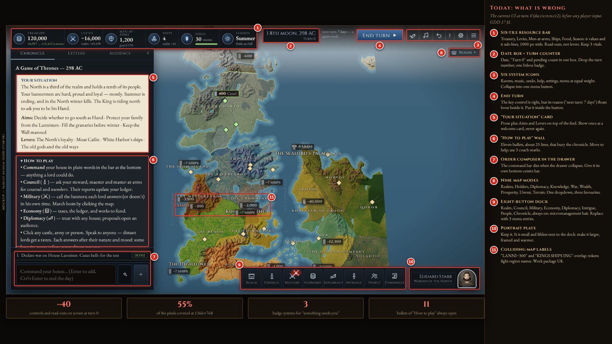
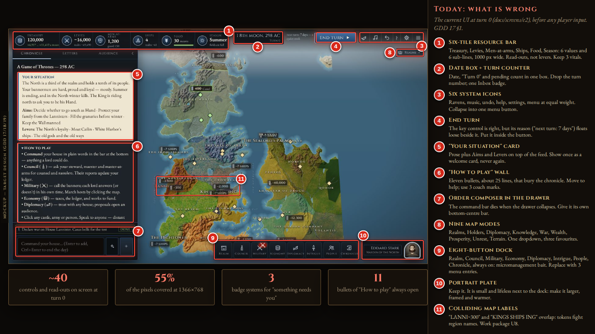

**Shows:** today's HUD at turn 0 (`docs/screens/e2/mode-political`, the real in-game screen; `d5/opening` is the title
screen, which has no HUD) with eleven numbered problems: the six-tile resource bar, the loose turn box, six system
icons, the "Your situation" card and the eleven-bullet "How to play" wall, the composer trapped in the drawer, nine map
modes, the eight-button dock, the portrait plate, and colliding map labels. The legend says what each becomes.
**Guides:** the audit in GDD 17 §1; the whole of **U1–U3, U8**.

## 02 · The quiet HUD (the target)

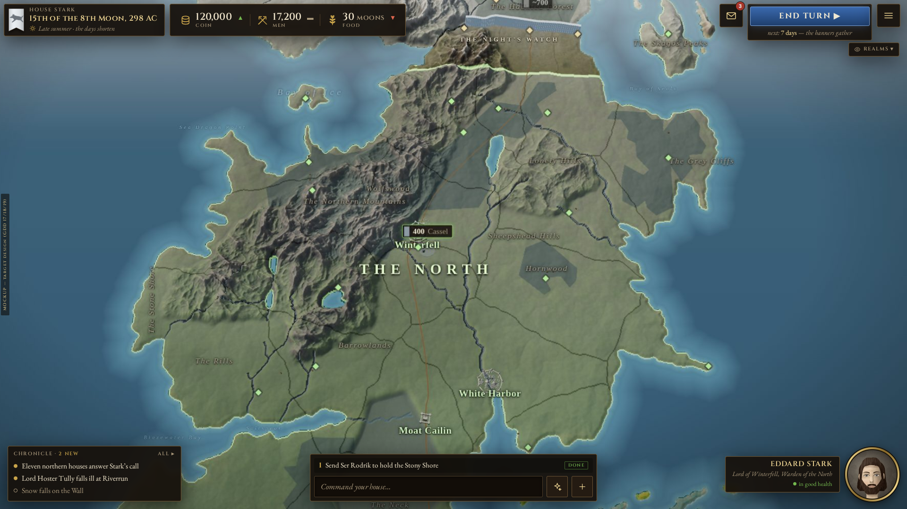
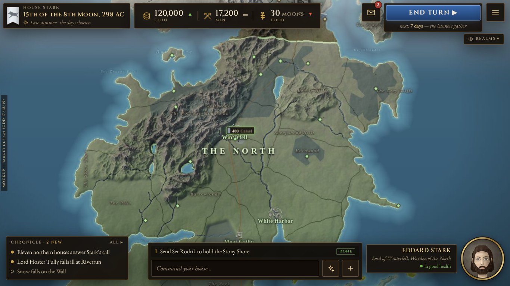

**Shows:** crest, date and season glyph top-left; three vitals (Coin, Men, Food) with trend arrows; one Inbox count,
the End turn button carrying its own reason ("next: 7 days, the banners gather") and one menu button top-right; a
three-line headline strip bottom-left; the command bar bottom-centre with its one queued order; the ruler's portrait
bottom-right, larger and framed. About 90 % of the screen is map.
**Guides:** **U1** (top bar, vitals, menu), **U3** (headline strip, Inbox, command bar), **U9** (portrait made better,
not removed). The map-mode chip is the one-dropdown of GDD 17 §2.8.

## 03 · The Chronicle feed (headlines)

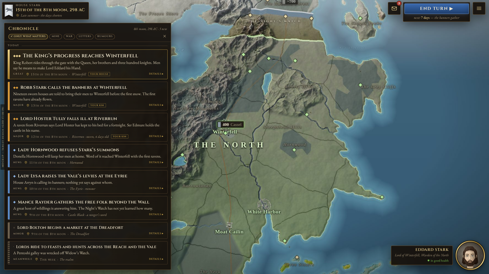
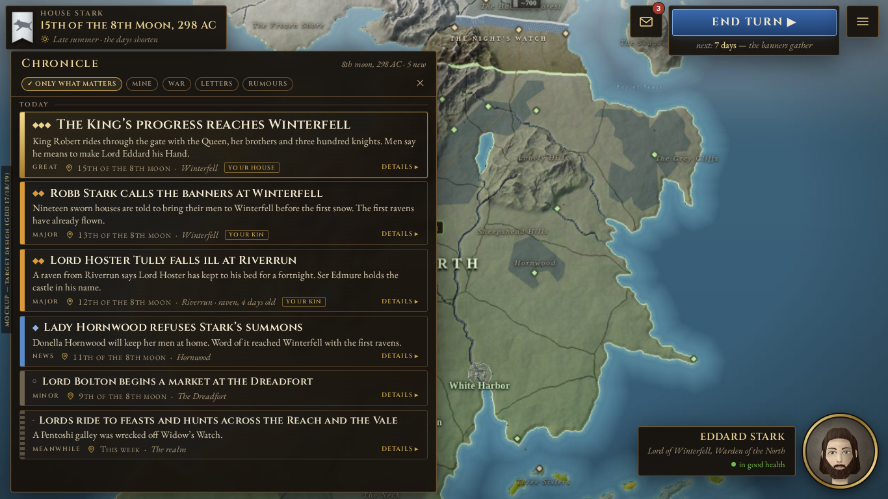

**Shows:** the strip expanded into the feed: eight cards, ranked by importance (three diamonds for great, two for major,
one for news, a hollow pip for minor, a dotted bar for "Meanwhile"), each with a headline of at most twelve words, a one-
to-three-sentence summary, a "date · place" line, an ownership tag ("Your house", "Your kin") and a collapsed
"Details ▸". "Only what matters" is on by default. At 1366×768 the two lowest news cards are dropped to fit; in the
game they scroll.
**Guides:** **N7** (feed rewrite, tiers, "Details"), with **N3/N9** (the writer's text and the ranking); **U3**.

## 04 · One event card, opened

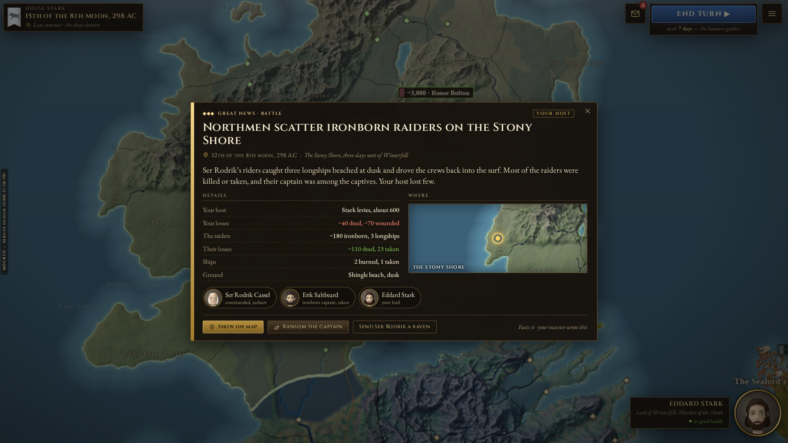
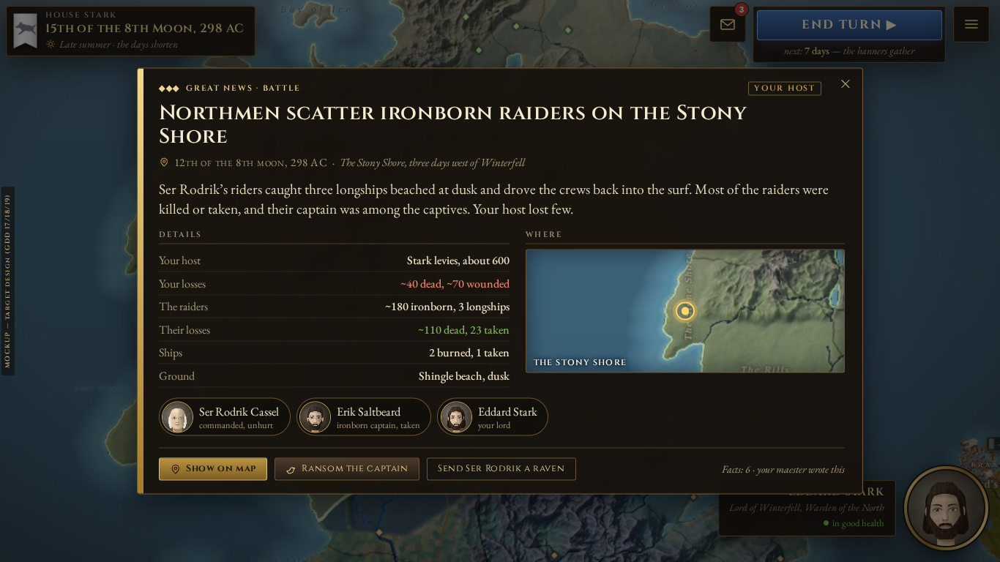

**Shows:** a great battle card expanded: headline, place and date, plain summary, the details list (numbers with `~`,
losses in red and gains in green, who was taken), a zoomed map of where it happened, the people involved as portrait
chips, "Show on map" and the lawful follow-up actions (which only pre-fill the command bar). The battle is invented for the
mockup.
**Guides:** **N7** (card body), **N8** (a pin's window is this card, its hover is the headline), **U4** (cards from the
map).

## 05 · The end-of-week digest

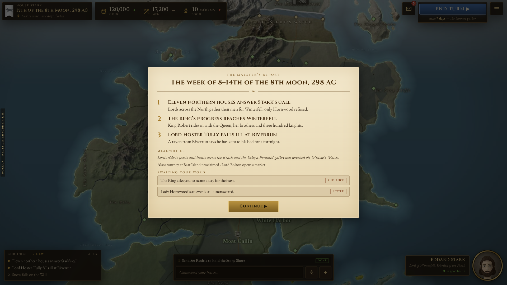
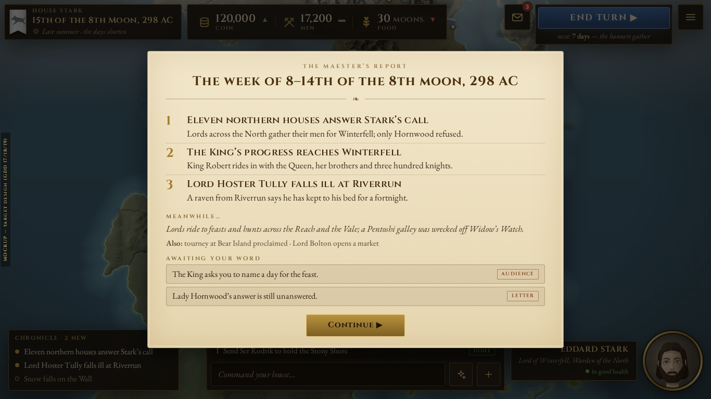

**Shows:** "The week of 8–14th of the 8th moon, 298 AC": the top three headlines with one sentence each, "Meanwhile…",
an "Also" line, what awaits the player's word (audiences and letters, so nothing waits unseen), and Continue. Under 90
words, assembled by the engine from the cards, never by the model.
**Guides:** **N6** (digest in the turn record) and **N7** (turn-end summary and jump feed), **N9** (ranking and the
Meanwhile line); **U3** (one Inbox).

## 06 · The State of the Realm

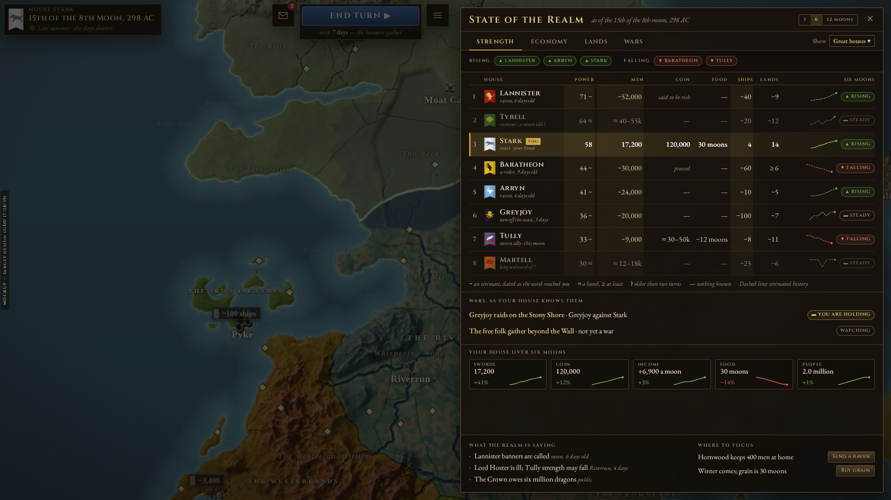
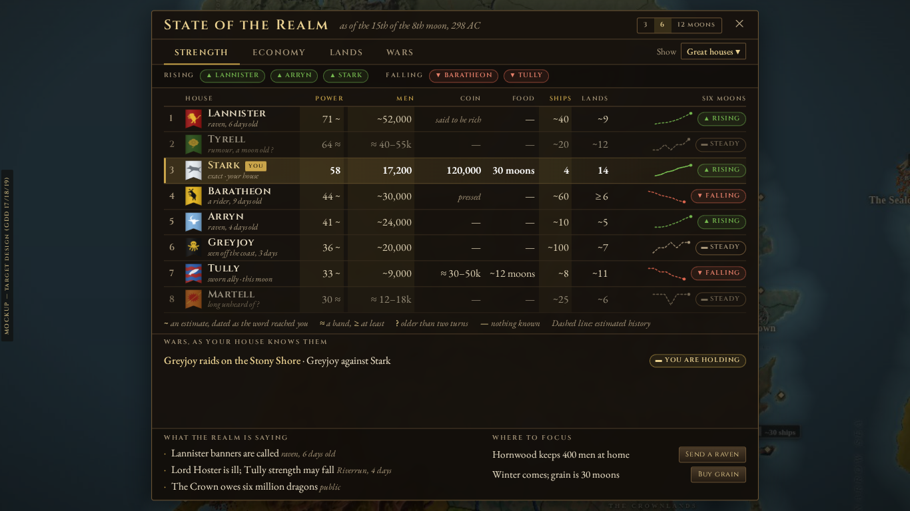

**Shows:** the ledger opened from the menu. Lens tabs (Strength · Economy · Lands · Wars), a "Rising / Falling" strip, and
one table: Power, Men, Coin, Food, Ships, Lands, and a six-moon sparkline with a Rising/Steady/Falling chip per house.
Stark is exact and highlighted; the others are `~` estimates dated as the word came ("raven, 6 days old"), `≈` bands, `—`
where nothing is known, a wealth *word* instead of a number for coin (never inferable), and a faded `?` for word older than
two turns. Below: the wars as the player knows them, five small multiples for the player's own house (tall screens
only), "What the realm is saying" and "Where to focus" (buttons only pre-fill the command bar). At 1366 it is a centred
overlay and the HUD steps aside, as in GDD 17 §2.9.
**Guides:** **R4** (the window), **R6** (wars, "where to focus"), **R2** (the `~`/`≈`/`—` marks come from the estimate
tiers), **U5/U6** (trend history and the panel); the knowledge rule is GDD 19 §5.

## 07 · The menu and a card opened from the map

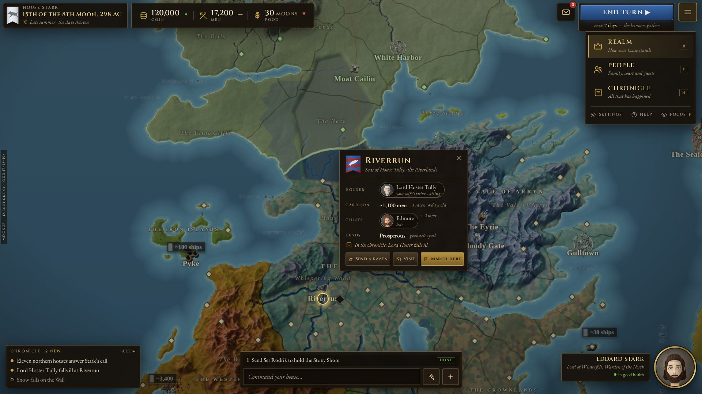
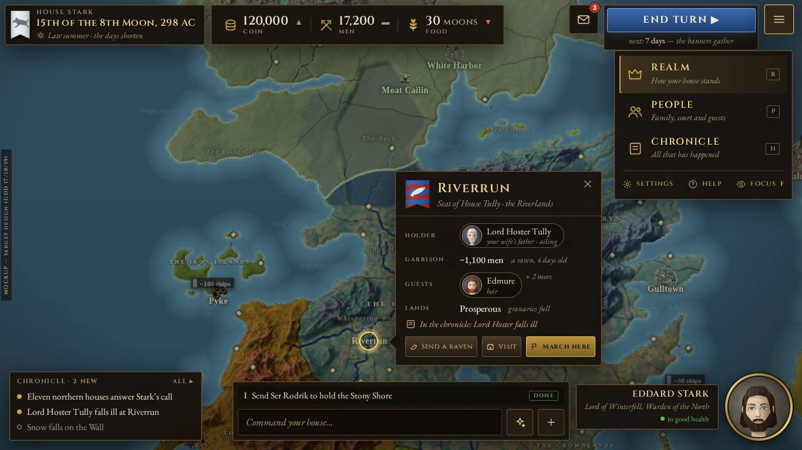

**Shows:** the menu button opened: three entries (Realm, People, Chronicle, each with its key), then Settings, Help and
Focus mode in one quiet row. On the map a castle (Riverrun) has been clicked: a card anchored beside it with holder,
garrison (`~`, dated), guests, lands, the chronicle link, and three actions: "Send a raven / Visit / March here".
**Guides:** **U2** (three-button menu, dock retired), **U4** (contextual cards; one card slot), **U8** (focus mode).

## 08 · First run

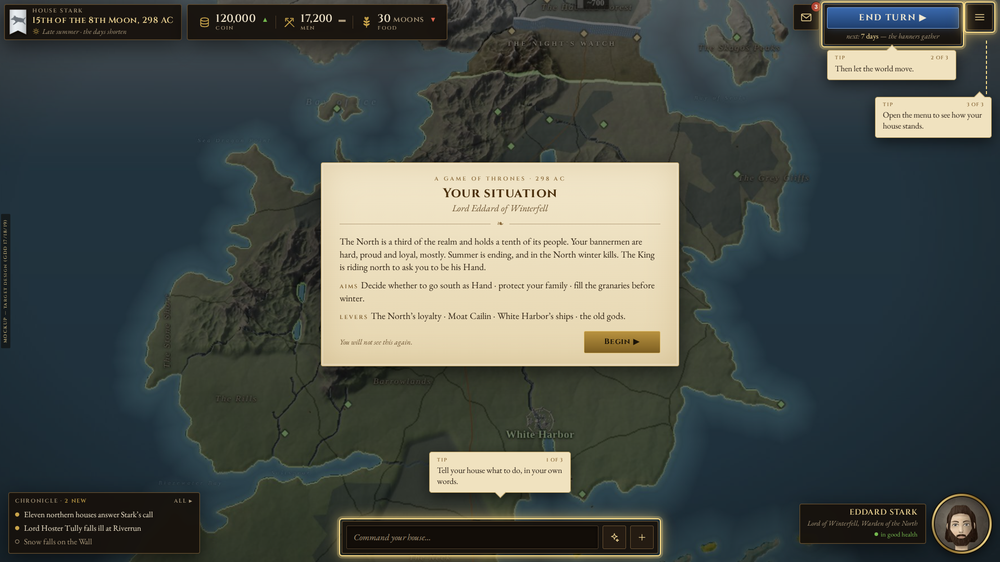
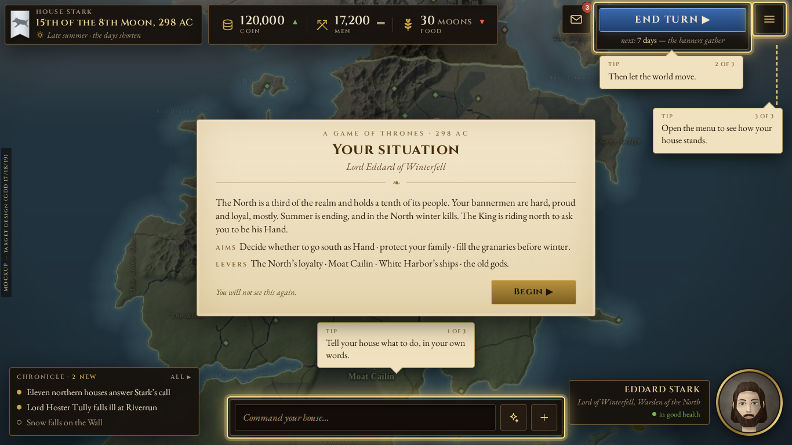

**Shows:** the one-time welcome card (the situation, aims and levers, one "Begin"), and the three coach marks that
follow, each a ring and one sentence, shown once, in order (in the game one at a time; all three here): the command bar,
End turn, the menu. The eleven "How to play" bullets live only behind `?`.
**Guides:** **U8** (first-run guidance, GDD 17 §2.6).
